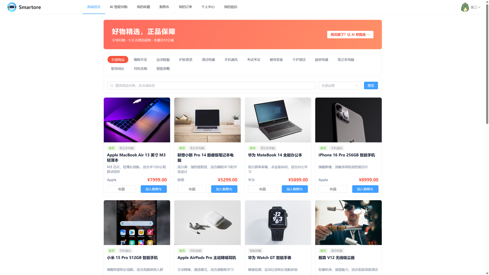
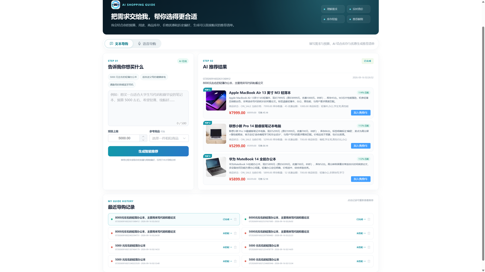
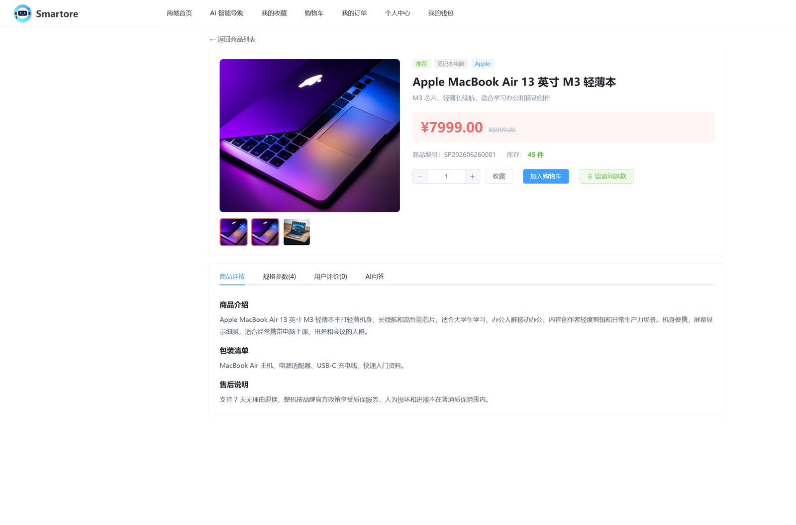
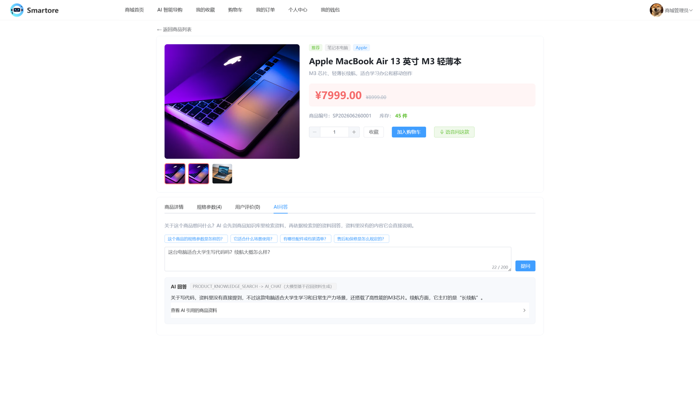
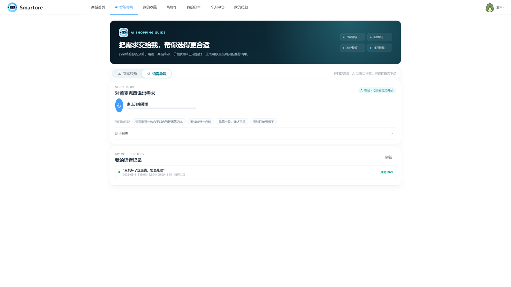
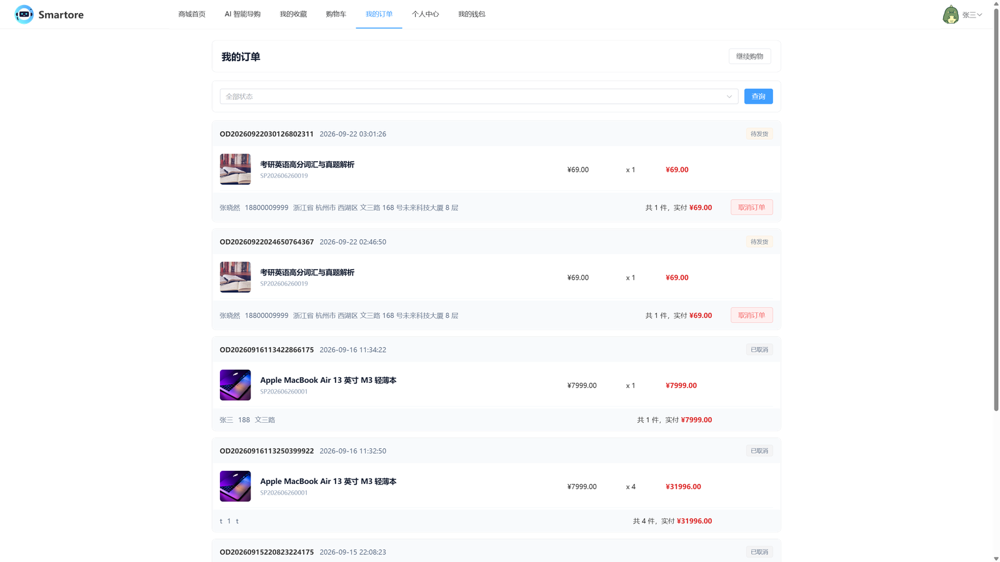
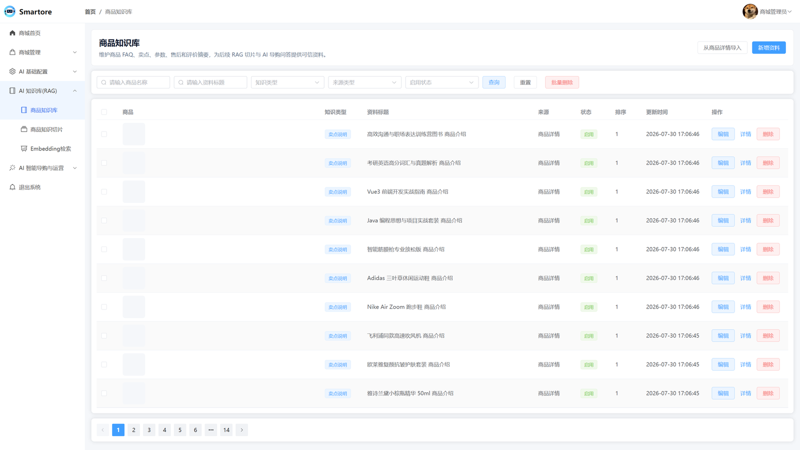
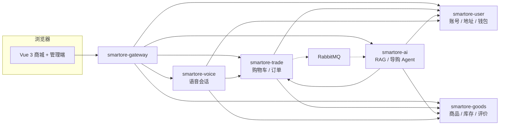
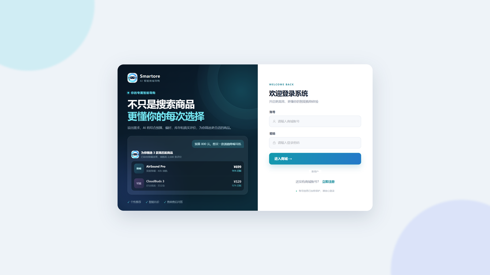

<p align="center">
  
</p>

<h1 align="center">Smartore</h1>

<p align="center">
  <b>一家会自己挑货、也能把单子做完的店</b><br/>
  逛店、问答、文本导购、语音导购，最后都落到同一套库存和钱包上
</p>

<p align="center">
  
  
  
  
  
  
  <a href="https://github.com/LittleSongxx/Smartore/actions/workflows/ci.yml"></a>
</p>

<p align="center">
  
</p>

---

**Smartore 是一套可本地跑通的 AI 电商。** 前面是能逛的商城和后台，中间是导购与知识库，后面是六个 Java 服务。模型可以推荐、可以回答，不能自己改价或跳过库存。下单、扣款、回补都走交易服务里的 Saga。

支付是余额模拟，没有真实资金。语音和文本共用同一套商品、订单和会话历史。

---

## 逛的时候在发生什么

<table>
<tr>
<td width="33%" valign="top">

**① 逛店**

首页、分类、搜索、详情都读商品服务的现价和库存。封面、卖点和品牌来自目录，不是聊天临时拼的卡片。

</td>
<td width="33%" valign="top">

**② 问这件**

商品页里可以直接问。回答先检索这件商品的知识切片，资料里没有的内容会直接说明，并留下引用。

</td>
<td width="33%" valign="top">

**③ 让它选**

说出预算和用途。导购任务进队列，Agent 多轮查候选、价格和库存，再给出可以加购的清单。

</td>
</tr>
</table>

<p align="center">
  
  <em>本地实跑：需求是「8000 元左右的轻薄办公本，主要用来写代码和看论文」。三台推荐都带现价、库存和匹配说明，可以直接加入购物车。</em>
</p>

<table>
<tr>
<td width="50%" valign="top">
<br/>
<b>商品详情</b> — 现价、库存、相册。旁边可以收藏、加购，或切到语音问这一件。
</td>
<td width="50%" valign="top">
<br/>
<b>问这件</b> — 问续航和是否适合写代码。回答标了检索来源，下面可以展开引用的切片。
</td>
</tr>
</table>

## 语音是另一条入口，不是另一套交易

同一页里可以切到语音。开口之后的推荐、澄清、下单确认，仍然回调用户、商品和交易服务。成交记录会出现在「我的订单」里。

<p align="center">
  
  <em>语音面板和一条已结束的会话：8 轮对话，成交 ¥69，和订单列表里的同一笔对得上。</em>
</p>

<p align="center">
  
  <em>买家订单页。待发货的两笔是语音通道落下的 ¥69 订单，取消单走的是同一套状态机。</em>
</p>

## 后台看的是同一份数据

管理端不是另一套商城。商品、订单、知识库、导购轨迹都在这里。知识要先写成资料，切片之后才能被问答检索到。

<p align="center">
  
  <em>商品知识库：卖点说明来自商品详情，状态为启用后才会进入后续切片和检索。</em>
</p>

## 架构

浏览器只打网关。网关做登录、角色和限流，再把用户身份传给后面的服务。服务之间不跨库连表，要别的域的数据就走内部接口。订单事件用 Outbox 投到队列，AI 服务消费后做镜像，不参与扣款。



```
                      Vue 3  （/api 与语音 WebSocket 都进网关）
                                      │
                              smartore-gateway
                         JWT · RBAC · 限流 · 信任头
                                      │
     ┌────────────┬────────────┬──────┴──────┬────────────┐
     ▼            ▼            ▼             ▼            ▼
 smartore-user  goods        trade          ai           voice
 账号/钱包       商品/库存     购物车/订单     RAG/Agent     ASR/TTS
 MySQL          MySQL        MySQL          MySQL        PostgreSQL
                                      │
                              Outbox → RabbitMQ → AI 镜像
```

六个服务的边界、为什么不用 Seata、导购为什么走队列、缓存允许多大陈旧，
写在 `docs/adr/` 和 `docs/architecture.md`。

## 技术栈

| | |
|---|---|
| **后端** | Java 21 · Spring Boot 3.5 · Spring Cloud 2025 · Spring Cloud Alibaba · MyBatis |
| **前端** | Vue 3 · Vite · Element Plus · 商城和管理端同一个应用 |
| **数据** | MySQL 四库（user / goods / trade / ai，Flyway）· PostgreSQL + pgvector（语音） |
| **中间件** | Redis · RabbitMQ · Nacos |
| **AI** | OpenAI 兼容接口 · 混合检索 · 导购工具调用 · 商品页 SSE 问答 |
| **工程化** | 请求 DTO + Bean Validation · Redis 缓存 · springdoc 接口文档 · 操作审计 · JaCoCo |
| **交付** | Docker Compose · GitHub Actions（测试、前端构建、手动部署） |

写接口统一收请求 DTO 并做分组校验（字段边界与越权字段在入口就拦掉），
商品目录挂 Redis 缓存（库存变动精确失效单品键），管理端写操作留痕可查，
接口文档在网关聚合成一页，`mvn test` 出覆盖率报告。这些约定的取舍见 ADR-0012 / ADR-0013。

```
backend/
  smartore-common/     返回体、异常、用户上下文、内部调用、共享装配（缓存/文档/审计）
  smartore-gateway/    认证、权限、限流、接口文档聚合
  smartore-user/       账号、地址、钱包
  smartore-goods/      商品、库存、评价、售后规则、缓存、审计
  smartore-trade/      购物车、订单 Saga、Outbox（退避重投）
  smartore-ai/         模型配置、知识库、导购、问答、审计
  smartore-voice/      语音会话、意图、目录向量
web/                   Vue 3 前台 + 管理端
deploy/                中间件与应用 Compose
ops/                   Nginx、监控、对账、systemd
docs/adr/              架构决策
```

## 运维与排查入口

服务起来之后，这些是排查时的第一站：

| 入口 | 在哪 | 用途 |
|---|---|---|
| 接口文档 | `http://localhost:9080/doc.html` | 五个服务的接口一页汇总（容器栈经 `/api` 反代不可达，直连网关） |
| 操作审计 | `GET /operLog/selectPage`、`GET /aiOperLog/selectPage` | 谁改了价格/库存/模型配置，含失败尝试 |
| Outbox 水位 | `GET /shopOrder/outboxStats` | PENDING / PUBLISHED / FAILED 计数 |
| Outbox 复位重投 | `POST /shopOrder/replayOutbox` | Rabbit 故障恢复后把 FAILED 事件重新投递（管理员） |
| 覆盖率报告 | `backend/*/target/site/jacoco/index.html` | `mvn test` 后生成 |

> 容器栈下重建某个服务后，若经 `http://localhost:8081/api/...` 返回 502 而直连 9080 正常，
> 是 nginx 缓存了容器的旧 IP：`docker restart smartore-web` 即可。

## 快速开始

依赖本机 Docker、JDK 21、Maven、Node.js 22。

```bash
./scripts/dev.sh bootstrap     # 生成 run/runtime.env（密钥不入库）
./scripts/dev.sh infra-up      # MySQL / Redis / RabbitMQ / Nacos / PostgreSQL
./scripts/dev.sh up            # 构建并启动六个服务
./scripts/dev.sh check         # 登录、路由、权限、语音 WebSocket

cd web && npm install && npm run dev
```

本地入口：前端 `http://localhost:5173`，网关 `http://localhost:9080`。

<p align="center">
  
</p>

也可以把前端构建进容器，和六个服务一起起：

```bash
cd backend && mvn -q package -DskipTests && cd ..
(cd web && npm run build)
docker compose -f deploy/compose.apps.yaml up -d --build
```

容器方式的浏览器入口是 `http://localhost:8081`。两种方式不要同时开，端口会撞。

模型 Key 写在 `run/runtime.env` 的 `SMARTORE_CHAT_API_KEY` / `SMARTORE_EMBED_API_KEY`。启动时加密进库，管理界面只看到掩码。

本地种子账号（只用于本机库，不要带到公网）：

| 角色 | 账号 | 密码 |
|---|---|---|
| 管理员 | `admin` | `admin` |
| 买家 | `aaa` | `123` |

## 这个仓库里没有的东西

内部审计台账、一次性验收摘录和实施状态草稿不在这里。架构说明和 `docs/adr/` 里的决策记录保留，因为它们就是这套系统为什么这样拆。
